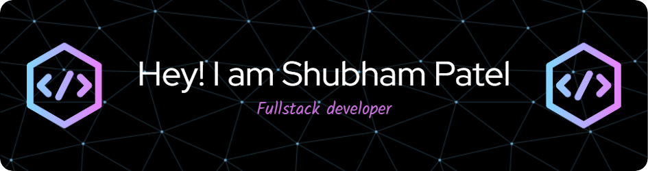

[

<h1 align="center">Hi 👋, I'm Shubham Patel</h1>
<h3 align="center">A passionate frontend developer from India</h3>

  

- 🌱 I’m currently learning **React Native , nodeJs**

- 💬 Ask me about **MERN**

- 📫 How to reach me **patelshubham9301@gmail.com**

<h3 align="left">Connect with me:</h3>

<h3 align="left">Languages and Tools:</h3>

               

&nbsp;

